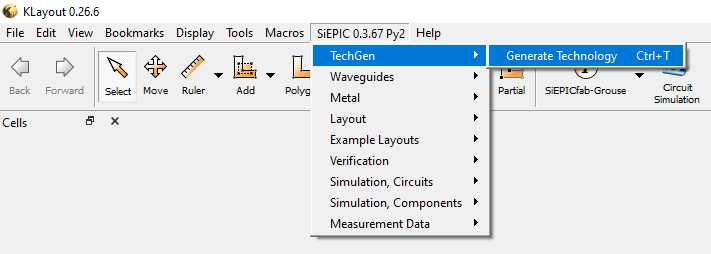

# PDK-Generator
---
## Documentation
Original Document: [2020-09-02 - PDK Generator Documentation](https://docs.google.com/document/d/1AZcLtxBP3Es7KQQUeFz-kNMr9YUiiQnCqvc7poQkn6Y/edit?usp=sharing) (PDF: [2020-09-02 - PDK Generator Documentation](documentation/pdf/2020-09-01-PDK_Generator_Documentation.pdf))

Block Diagrams: [2020-09-02 - PDK Generator Block Diagrams](https://drive.google.com/file/d/1Np60c2HCSbc5uBqF6jlfVhq8i1fgH7c7/view?usp=sharing) (PDF: [2020-09-02 - PDK Generator Block Diagrams](documentation/pdf/2020-09-02-PDK_Generator_Block_Diagrams.pdf))

## Software Installation
### KLayout
Install KLayout version 0.25 or greater: [http://www.klayout.de/build.html](http://www.klayout.de/build.html)

### Installation via GitHub Desktop
**On MacOS:**

This example assumes you are cloning the repo in your Desktop folder.

1. Clone this repostory using GitHub Desktop.
2. Create a symbolic link from the repo PDK-Generator folder into your KLayout salt folder.

`$ cd $HOME/.klayout/salt`

`$ ln -s $HOME/Documents/GitHub/PDK-Generator PDK-Generator`

3. Start KLayout
4. Under the SiEPIC menu, TechGen should be available

**On Windows:**

This example assumes you are cloning the repo in your Desktop folder.

1. Clone this repostory using GitHub Desktop.
2. Create a symbolic link (via cmd line running as administrator) from the repo PDK-Generator folder into your KLayout salt folder.

`cd C:\Users\seanl\KLayout\salt`

`mklink /J PDK-Generator "C:\Users\seanl\Desktop"`

3. Start KLayout
4. Under the SiEPIC menu, TechGen should be available

